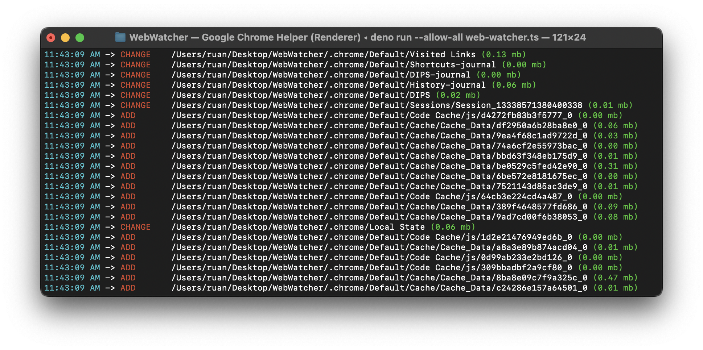

# About the software

WebWatcher is a command-line interface ([CLI](https://en.wikipedia.org/wiki/Command-line_interface)) program designed for monitoring and analyzing events generated by a [Google Chrome](https://en.wikipedia.org/wiki/Google_Chrome) instance. It enables users to access and analyze events stored in the memory of their computer, regardless of whether they are using [Windows](https://en.wikipedia.org/wiki/Microsoft_Windows), [MacOS](https://en.wikipedia.org/wiki/MacOS), or [Linux](https://en.wikipedia.org/wiki/Linux).

## Requirements

Before using WebWatcher, please ensure that you meet the following requirements:

1. **Google Chrome**: To run the program in its binary form, you must have the latest version of [Google Chrome](https://en.wikipedia.org/wiki/Google_Chrome) installed on your computer.

2. **Deno (for source code testing)**: If you intend to test the program from its source code, which is written in TypeScript, you need to install [Deno](https://deno.com) on your computer. We recommend using [Visual Studio Code](https://code.visualstudio.com) in conjunction with the [Deno extension](https://marketplace.visualstudio.com/items?itemName=denoland.vscode-deno) to enable script intellisense for a smoother development experience.

## Compilation

To compile WebWatcher into an executable binary, follow these steps:

1. Open your terminal and navigate to the project folder.

2. Execute the following command:

   ```sh
   deno compile --allow-all web-watcher.ts
   ```

## Execution

You can run Web Watcher in two different ways:

1. **From source code**: To run the program directly from its source code, use the following command:

   ```sh
   deno run --allow-all web-watcher.ts
   ```

2. **From compiled binary**: If you've compiled Web Watcher into an executable binary, you can execute it using the following command:

   ```sh
   ./web-watcher
   ```

The project is [MIT-0](https://opensource.org/license/mit-0) licensed, so feel free to choose the method that best suits your needs. Enjoy using Web Watcher to monitor and analyze Google Chrome events!

<p align="center">
   
</p>
